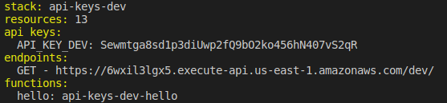
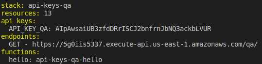
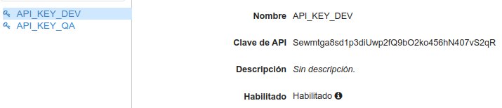
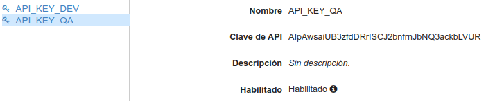
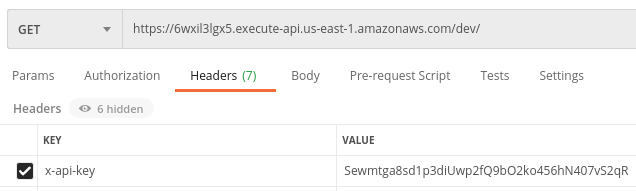

# Seguridad en servicios con API KEYs

1. Iniciamos el proyecto serverless

2. En el archivo **serverless.yml** añadimos en la entrada *provider* inicializamos las variables profile, stage y región. Además añadimos ua nueva entrada llamada apiKeys que hará referencia a un archivo json de configuración por cada entorno:

~~~
provider:
  name: aws
  runtime: nodejs12.x
  profile: curso-sls
  stage: ${opt:stage, 'dev'}
  region: us-east-1

  apiKeys:
    - ${file(./config.${self:provider.stage}.json):API_KEY}
~~~

3. Creamos tantos archivos de configuración como entornos que queramos configurar. En nuestro caso de ejemplo crearemos uno para *dev* y otro para *qa*:

~~~
{
  "API_KEY": "API_KEY_DEV"
}
~~~

~~~
{
  "API_KEY": "API_KEY_QA"
}
~~~

4. Hacemos el despliegue para dev y qa...

`sls deploy --stage dev`

`sls deploy --stage qa`

5. Comprobamos que en cada deploy se nos genera una key para cada entorno

6. Comprobamos en la consola de amazon, en el servicio API Gateway que efectivamente se han creado esas keys:

7. Privatizamos el endpoint habilitando en el archivo **serverless.yml** el evento de nuestra función como privado:

~~~
functions:
  hello:
    handler: handler.hello
    events:
      - http:
          path: /
          method: get
          private: true
~~~

8. En la llamada a la api pasamos como elemento del header x-api-key con el valor que nos ha asignado API Gateway para ese entorno:

